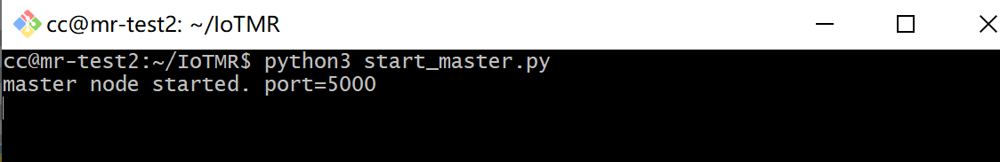
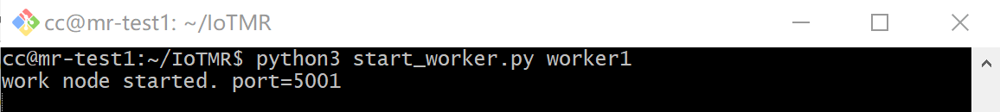
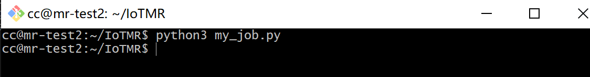
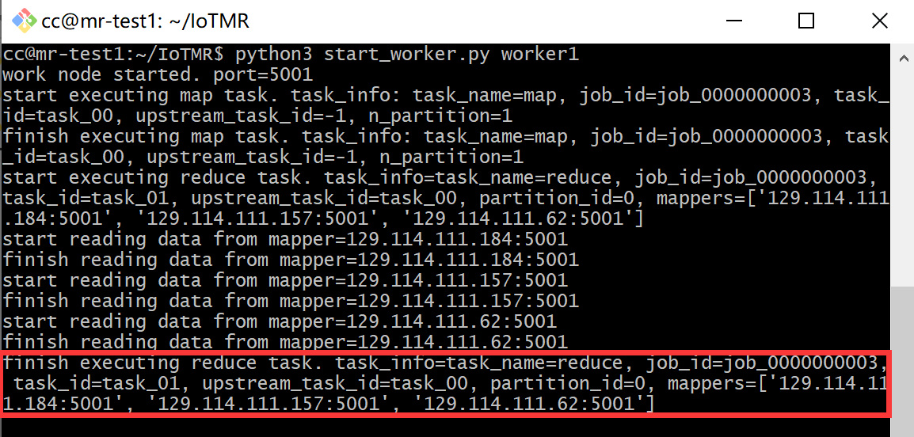
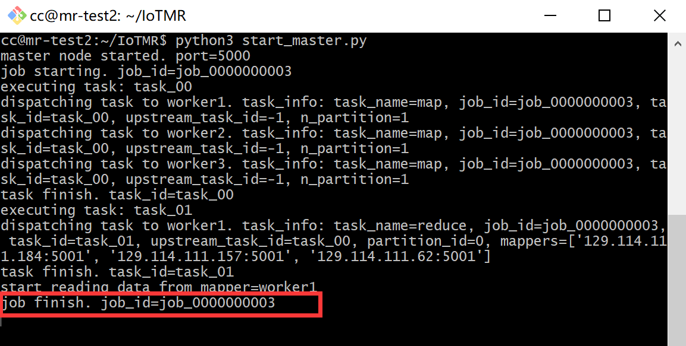

# IoTMR

This project is a simple map reduce framework that is suitable for IoT data processing.

## Requirements

1 jdk 1.8

2 zookeeper 3.4.13

3 python 3.5 or 3.6

Works for both windows and linux.

## How to run it

The following are tested on 2 Ubuntu 16.04 machines, one as master node, the other as work node. Work node is responsible for executing both map and reduce task.

0 Install dependencies using "pip3 install -r requirements.txt"

1 Change config/test.ini according to your own network topology. 

2 Download and start zookeeper on your master node using "bin/zkServer.sh start".

3 Start the process on master node using "python3 start_master.py"

4 Start the process on each work node using "python3 start_worker.py worker1", the second argument is used to specify which configuration item to use when starting this worker. Start all other word nodes in the same way, remember to change the second argument accordingly.

5 Write your own mapreduce job and submit it at master node. We have written a sample job named my_job.py, you can submitted it using "python3 my_job.py" (execute this at master node). 

6 You can see the job execution on master node and task execution on work node. After the job is finished, the result will be stored in the tmp directory at master node. You will need to know your job id to locate the corresponding result file.

Task execution.

Job execution

